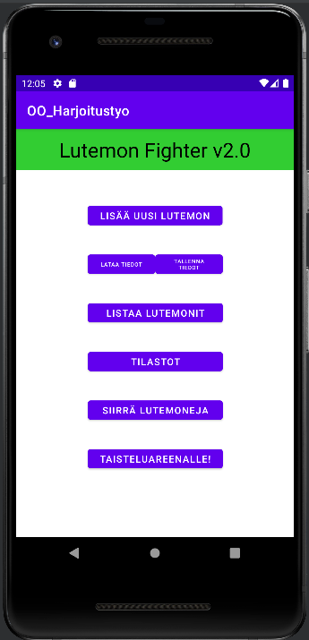
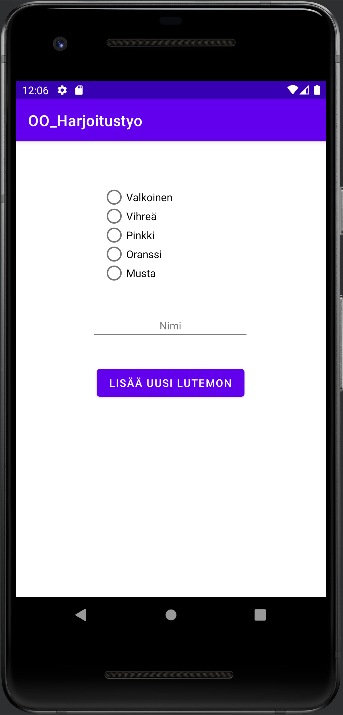
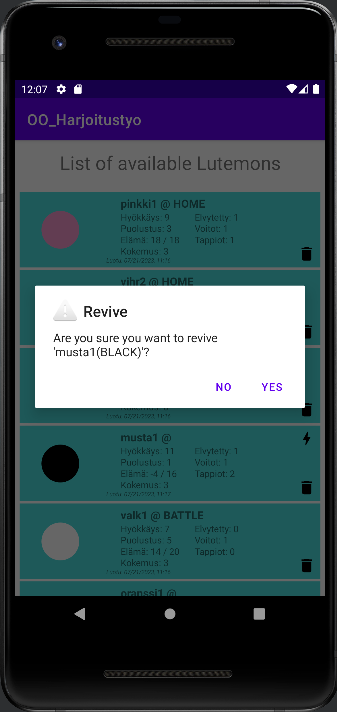
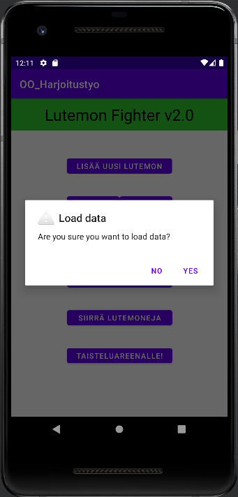
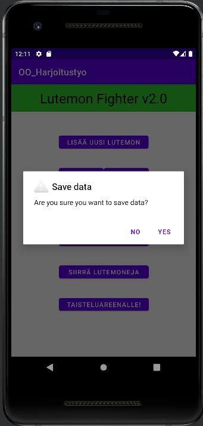
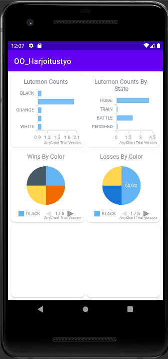
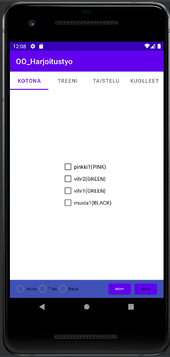
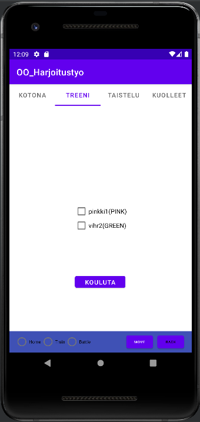
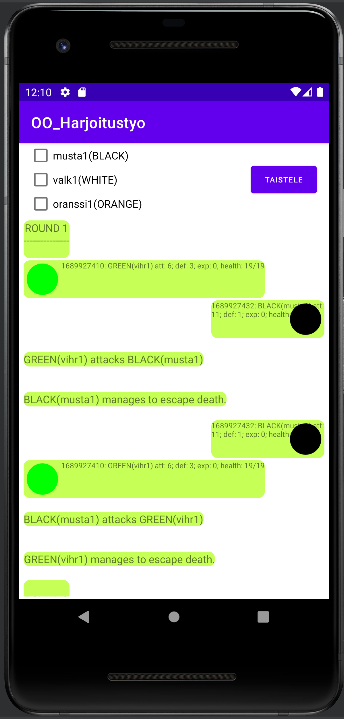
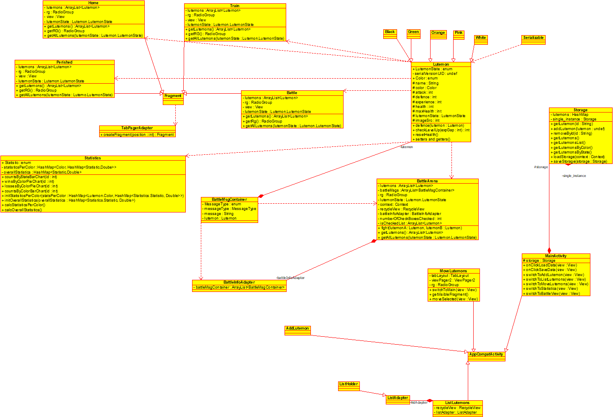

# Object oriented programming: final project

## Realized features for scoring
|Vaatimus|Tehty
|-|-
|Perusvaatimukset|x
|RecycleView|x
|Lutemonilla on kuva|x
|Taistelu on visualisoitu|x
|Tilastot|x
|Kuolema pois|x
|Satunnaisuus|
|Fragmentit|x
|Tietojen tallennus ja lataus|x
|Tilastojen visualisointi|x
|GridLayout (NEW)|x
|Lutemonin poisto pysyvästi (NEW)|x
|Kuvan lataaminen tiedostosta (NEW)|
|Tilastotietojen tallennus (NEW)|
|Vuoropohjainen taistelu (NEW)|
|Taistelusta voi poistua kesken kaiken (NEW)|

## Project description and manual

The goal of this project is to be able to generate new Lutemons, train them, being able to fight between then, save their data for later use and display various statistics.

The landing view or the first view when the program starts is from now on called "the main view".

<h4>Generating new Lutemons</h4>
Open main view and press "Lisää uusi Lutemon". Choose a colour, give a name and press "Lisää uusi Lutemon" to add it to DB.

<h4>List all available Lutemons</h4>
Press "Listaa Lutemonit" at main view. Not only are all Lutemons shown here but a number of statistics are shown as well. When a Lutemon Perishes in order to restore it come back to this view and press on the lightning icon on top of its card.

In order to remove Lutemon permanently press the thrash bin icon on bottom lower corder of its card.

<h4>Training Lutemons</h4>
Assuming you have already generated a new Lutemon to be able to train it you must go to "Siirrä Lutemoneja", select as many Lutemons as you want, select "Treeni" on bottom of the view and press "Siirrä". Having done that navigate to Treeni, select as many Lutemons as you want and press "Kouluta" button in the middle of the screen to train all of the selected Lutemons. 

Should the lutemon get enough experience points a level up message should pop up to the screen.

<h4>Fighting Lutemons</h4>
Having generated at least two Lutemons, go to "Siirrä Lutemoneja" and move them to "Taistelu" by selecting as many Lutemons as you want, selecting "Taistelu" from the bottom of the view and pressing "Siirrä". 

Go back to main view, and navitage to "Taisteluareenalle."

Select at most two Lutemons and make note of their order as the one selected first will be the attacker. Press "Taistele" on top right corner to begin combat. 

The progress of the fight is shown in the botton part of the screen and the fight continues until one of the combatants perish. 

The slaying party will receive an experience point and two such points will grant a level up. 

Should one want to review their Lutemon this can be accomplished from the "Listaa Lutemonit" at the main view. A Lutemon can be revived when its card has a lightning icon on the top right corner.

<h4>Statistics</h4>
In order to see various statistics related to the Lutemons navitage to "Tilastot" in the main view. All of the statistics are interactive. 

<h4>Saving and loading</h4>
Both save and load of current state of the Lutemons can be accomplished by pressing "Tallenna tiedot" in order to save and "Lataa tiedot" load. Note that if Lutemons are deleted permanently and save is done after this all progress is lost.

## GUI Pictures

## Class diagram 

## Known bugs:
- Sometimes PERISHED state is not displayed in lutemon list view even though this is the case and it is registered by the move lutemons view
- cannot move more than one lutemon at a time between states/locations (`FIXED`)
- lutemons' stats information does not fit completely into left/right layout in battle view

## Future development possibilities:
- additional stats such as armor, dexterity etc. 
- user profiles
- cloud saves
- concept of time
- turn based combat
- wounds heal over time
- equipment
- loot
- crafting
- escape from battle
- spells and buffs

## Completed
### Not done:
- combat graphics (animations need to be used for full points; lighter version with recycle view has already been implemented)
- randomization
- unit tests
- documentation and class diagrams to `/documentation` and `/documentation/ht.xmi`!
- finally: review points achieved, check for bugs and most importantly make sure the program works!
- training button at train move view
- restore also in perished move view
- when selecting lutemons to battle one is able to choose their order (aka there's a listener in the checkboxes that in addition to registering order also notifies the user that only 2 can be selected at a time or the order 
is selected afterwards (no listener required))
- turn based combat (OPTIONAL, request more points)
- make it possible to load lutemon image from file (OPTIONAL, request more points)
### Done: 
- restore perished lutemons
- graph statistics (e.g AnyChart package)
- collect statistics
- main view
- a) loading of objects in different fragments based or b) state or information passing between fragment
- fragment functionality /w viewpager2 and tab
- save / load of storage
- implement recycleview
- add pictures to each lutemon (currently fixed, but different nonetheless)
- implement fragments

## Changes:
#### 07/21/2023
- added storage load and save functionalities, and buttons to main view
- added new statistics page to main layout
- added statistics in a gridlayout containing various AnyChart objects
#### 07/20/2023
- added AnyChart to Android Studio and tested its functionality
- battle recycle views and layouts need to be adjusted and aligned properly; adding simple animations when each combatant is introduced
- began implementing charts for statistics (groupings by color have to be performed separately or a common DB used to collect overall stats that maintain information even after deleting lutemons)
- training mode completed
- experience earned either from combat or training will grant a level up (atm in every 2 points) giving 2 points of attack and 1 point of defence
- those lutemons that perish in battle are now removed from the list of fighters immediately after the fight concludes (in order to revive them refer to the list view)
- added some statistics and some of it is shown along with the lutemon list such as no wins, no lossses, and no of revives
- added checkbox listeners to battle view: it's possible to only select two AND their sequence determines combat order
#### 07/19/2023
- added recycle view that is capable of showing multiple layouts to battle display
- added revive button (a lightning icon) to list view: when lutemon is at PERISHED state then a button to revive lutemon back to max health becomes visible; the revived lutemon is automatically moved back HOME
#### 07/18/2023
- fixed a bug not being able to switch states of more than one lutemon at a time (fixed by using id's to identify the checkboxes when removing them instead of int based identifier (which simialary to a list or array list doesn't work when the contents is changed; unique id is immune to this))
- added dialogue verification for lutemon permanent deletion
- added toast reminders when adding new lutemons and moving/changing states
- resetting all radio buttons when buttons are pressed
- added some battle arena functionalities:
    * selection of fighters (move state to BATTLE)
    * added textview in order to show text based information about the battle
#### 07/17/2023
- implemented load and save features for storage 
- decided to apply lutemon mover in separate page instead of within fragments. this realization enables the use of enum 
since fragment to fragment direct communication is no longer needed 
- added times created to each lutemon that is also used as their id's in the storage hashmap
- added states of color and location for Lutemons
- as result of implementing states/locations all objects are loaded from main storage and allocated to each fragment on load fragment load
- changed storage hashmap keys from integers to string which is based on the created object instance time in milliseconds
#### 07/16/2023
- N/A
#### 07/15/2023
- began implementing statistics collection
- Main GUI pages: initialized, add page
- TabView2 & ViewPager2 added to move Lutemon page
- RecycleView added to list Lutemon page
- Add Lutemon page working and showing all generater instance on list Lutemon page
- Lutemon class and its subclasses added
- Storage singleton added
- Drawable picture reference added to Lutemon subclasses, not compulsory
- Included fragments: initialized
- Lutemons: storage, super class and subclasses done
- Functionalities: not done
- Additional features that you want additional points from: 
    * sorting list based on lutemon's abilities (string: name, int: power, defence, health)
    * sorting list based on time added (this field needs to be added)